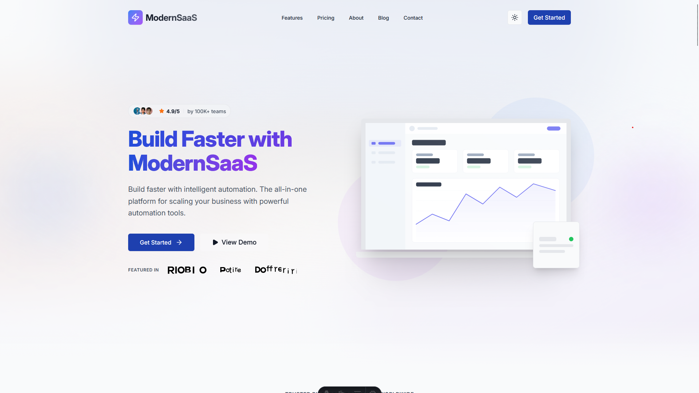

<div align="center">

# ModernSaaS Landing Page Template


[](https://github.com/MasuRii/ModernSaaS-LandingPage-Template/actions)
[](https://github.com/MasuRii/ModernSaaS-LandingPage-Template/actions/workflows/deploy.yml)
[](package.json)
[](LICENSE)
[](CONTRIBUTING.md)

**A production-ready, visually stunning SaaS startup landing page template
featuring modern 2026 design trends, comprehensive light/dark mode support, Core
Web Vitals optimization, and seamless GitHub Pages deployment.**



[🚀 Live Demo](https://masurii.github.io/ModernSaaS-LandingPage-Template/) |
[Documentation](#documentation) | [Quick Start](#quick-start)

</div>

---

## Features

- **Blazing Fast** - Built with Astro 5 for near-zero JavaScript by default.
  Perfect Lighthouse scores.
- **Modern Design** - 2026 design trends including glassmorphism, bento grids,
  and mesh gradients.
- **Dark Mode** - First-class dark mode support with automatic system preference
  detection and persistent toggle.
- **Fully Responsive** - Optimized for all devices from 320px mobile to
  ultra-wide desktops.
- **SEO Optimized** - Built-in JSON-LD structured data, automatic sitemaps, and
  optimized meta tags.
- **Production-Grade Testing** - 1,100+ unit tests and comprehensive E2E suite
  using Playwright.
- **Atomic Components** - Highly reusable UI components built with React and
  Tailwind CSS v4.
- **Fluid Animations** - Smooth, hardware-accelerated animations using Motion
  One with reduced motion support.
- **Content Driven** - Easily customizable via centralized data files.

## Tech Stack

| Category          | Technology                                                              |
| ----------------- | ----------------------------------------------------------------------- |
| **Framework**     | [Astro](https://astro.build) v5.17.2                                    |
| **UI Library**    | [React](https://react.dev) v19.2.4                                      |
| **Styling**       | [Tailwind CSS](https://tailwindcss.com) v4.1.18                         |
| **Animations**    | [Motion One](https://motion.dev) v12.34.0                               |
| **UI Primitives** | [Radix UI](https://www.radix-ui.com)                                    |
| **Icons**         | [Lucide React](https://lucide.dev)                                      |
| **Testing**       | [Vitest](https://vitest.dev), [Playwright](https://playwright.dev)      |
| **Runtime**       | [Bun](https://bun.sh)                                                   |
| **Deployment**    | [GitHub Pages](https://pages.github.com) / [Vercel](https://vercel.com) |

## Quick Start

### Prerequisites

- [Bun](https://bun.sh) (recommended) or [Node.js](https://nodejs.org) 18+
- [Git](https://git-scm.com)

### Installation

```bash
# Clone the repository
git clone https://github.com/MasuRii/ModernSaaS-LandingPage-Template.git
cd ModernSaaS-LandingPage-Template

# Install dependencies
bun install  # or npm install

# Start development server
bun dev  # or npm run dev
```

The site will be available at `http://localhost:4321`

## Commands

All commands are run from the root of the project:

| Command                 | Description                                |
| ----------------------- | ------------------------------------------ |
| `bun install`           | Install dependencies                       |
| `bun dev`               | Start local dev server at `localhost:4321` |
| `bun build`             | Build production site to `./dist/`         |
| `bun preview`           | Preview production build locally           |
| `bun run typecheck`     | Run TypeScript type checking               |
| `bun run lint`          | Run ESLint for code quality                |
| `bun run format`        | Run Prettier for code formatting           |
| `bun run test`          | Run unit tests with Vitest                 |
| `bun run test:coverage` | Generate test coverage report              |
| `bun run test:e2e`      | Run E2E tests with Playwright              |
| `bun run test:a11y`     | Run accessibility tests with axe-core      |
| `bun run test:perf`     | Run Lighthouse performance audit           |
| `bun run test:visual`   | Run visual regression tests                |

## Project Structure

```
ModernSaaS-LandingPage-Template/
├── .github/workflows/        # CI/CD (GitHub Actions)
├── e2e/                      # End-to-end tests (Playwright)
│   ├── tests/                # E2E test files
│   ├── snapshots/            # Visual regression baselines
│   └── VISUAL_REGRESSION.md  # Visual testing documentation
├── public/                   # Static assets (images, fonts, robots.txt)
├── scripts/                  # Utility scripts (image fetching, deployment)
├── src/
│   ├── assets/               # Project-specific assets
│   ├── components/           # UI components (Atomic design)
│   │   ├── layout/           # Layout components (Header, Footer)
│   │   ├── sections/         # Page sections (Hero, Features, etc.)
│   │   └── ui/               # Reusable UI components
│   ├── config/               # Centralized configuration
│   ├── content/              # Content collections (blog posts)
│   ├── data/                 # Content data files (JSON/TS)
│   ├── hooks/                # Custom React hooks
│   ├── layouts/              # Page layouts
│   ├── lib/                  # Utility libraries
│   ├── pages/                # Astro pages and routing
│   ├── styles/               # Global styles and CSS tokens
│   ├── types/                # TypeScript definitions
│   └── utils/                # Shared utility functions
├── tests/                    # Unit and integration tests (Vitest)
│   └── unit/
├── CHANGELOG.md
├── CONTRIBUTING.md
├── CUSTOMIZATION.md
└── package.json
```

## Customization

### Content

Edit the data files in `src/data/` to update the site content:

- **`features.ts`** - Feature lists, bento grid content, zigzag sections
- **`pricing.ts`** - Pricing tiers, billing cycles, feature comparisons
- **`testimonials.ts`** - Customer quotes, avatars, ratings
- **`team.ts`** - Team member profiles
- **`integrations.ts`** - Integration partners and logos
- **`faq.ts`** - Frequently asked questions
- **`navigation.ts`** - Header and footer navigation

### Branding & Configuration

Update `src/config/site.ts` to change:

- **Company Name**: `company.name`
- **Tagline**: `company.tagline`
- **Social Links**: `social` object
- **Contact Info**: `contact` object
- **SEO Defaults**: `seo` object
- **Feature Flags**: Enable/disable features (newsletter, search, darkMode)

### Styling

The template uses **Tailwind CSS v4** with CSS variables in
`src/styles/tokens.css`:

- **Primary Color**: Update `--primitive-color-primary-*` scale
- **Secondary Color**: Update `--primitive-color-secondary-*` scale
- **Typography**: Update `--font-family-sans` and `--font-size-*` tokens

## Environment Variables

| Variable       | Description                                                | Example                            |
| -------------- | ---------------------------------------------------------- | ---------------------------------- |
| `SITE_URL`     | Production URL for sitemaps and canonical URLs             | `https://my-saas.com`              |
| `BASE_PATH`    | Subdirectory path (e.g., `/my-repo`)                       | `/ModernSaaS-LandingPage-Template` |
| `GITHUB_PAGES` | Set to `true` for GitHub Pages subdirectory auto-detection | `true`                             |

Copy `.env.example` to `.env` and update the values for your deployment.

## Deployment

This project supports both **GitHub Pages** and **Vercel** deployment:

### GitHub Pages (Automatic)

1. Push your code to GitHub
2. Enable GitHub Pages in repository settings (Settings → Pages → Source: GitHub
   Actions)
3. The included workflow will automatically build and deploy on every push to
   `main`
4. Your site will be available at `https://<username>.github.io/<repo-name>/`

### Vercel

1. Push your code to GitHub
2. Import the repository in [Vercel](https://vercel.com)
3. Set environment variables in Vercel dashboard
4. Deploy!

For other platforms, run `bun build` and deploy the `dist/` folder.

## Testing

The template includes a comprehensive testing suite:

### Unit & Integration Tests

```bash
# Run all unit tests
bun run test

# Generate coverage report
bun run test:coverage
```

### End-to-End Tests

```bash
# Run all E2E tests
bun run test:e2e

# Run with UI mode
bun run test:e2e:ui

# Run production smoke tests
bun run test:e2e:prod
```

### Accessibility & SEO

```bash
# Run accessibility audit
bun run test:a11y

# Run Lighthouse audit
bun run test:perf
```

## Documentation

- [Customization Guide](./CUSTOMIZATION.md) - Detailed customization
  instructions
- [Contributing Guidelines](./CONTRIBUTING.md) - How to contribute to this
  project
- [Changelog](./CHANGELOG.md) - Version history and changes
- [Visual Regression Testing](./e2e/VISUAL_REGRESSION.md) - Visual testing
  documentation

## Contributing

Contributions are welcome! Please read our
[Contributing Guidelines](./CONTRIBUTING.md) before submitting a pull request.

We follow:

- [Conventional Commits](https://www.conventionalcommits.org/) for commit
  messages
- ESLint and Prettier for code style
- Git Flow branching strategy

---

<div align="center">

**Built with love by [MasuRii](https://github.com/MasuRii)**

If you found this helpful, please consider giving it a star!

[](https://github.com/MasuRii/ModernSaaS-LandingPage-Template)

</div>
